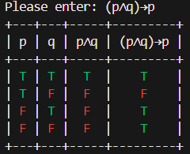
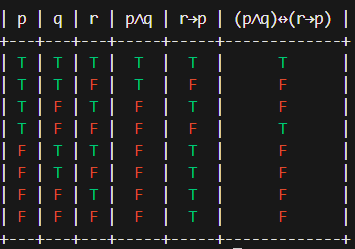
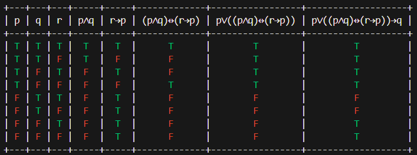

# Truth Table Generator
<p float="center">
  
  
  
</p>
This is a simple yet powerful Truth Table Generator that can handle complex logical expressions. It supports various logical operators such as → (implication), ↔ (equivalence), ∧ (conjunction), ∨ (disjunction), and ~ (negation). The tool also automatically detects and handles parentheses in the input expression.

## Features
+ Generates truth tables for logical expressions with multiple variables
+ Supports various logical operators: →, ↔, ∧, ∨, and ~
+ Automatically detects and handles parentheses in the input expression
+ User-friendly interface with colored notifications and terminal clearing

## Installation
Follow these steps to set up the project:

1. Clone the repository
```bash
git clone https://github.com/username/repo.git
```
2. Open directory
```bash
cd Truth-Table
```
3. Install the dependencies
```bash
pip install -r requirements.txt
```
4. Run 
```bash
python main.py
```

## Usage
+ Run the script to start the Truth Table Generator.
+ Enter your logical expression (e.g., A ∧ B). You can copy and paste the required operators from the provided list if needed.
+ The script will then generate the truth table for the given expression, displaying the results in a clear and easy-to-understand format.

## Example
Suppose you want to generate a truth table for the expression (p∧q)→p. Here's how you can do it:

1. Run the script.
2. Enter the expression as (p∧q)→p.
3. The script will generate the truth table, displaying the results like this:

| p | q | p∧q | (p∧q)→p |
| :-: | :-: | :-: | :-: |
| T | T | T | T |
| T | F | F | F |
| F | T | F | T |
| F | F | F | T |

## License
This project is licensed under the MIT License - see the LICENSE.md file for details
